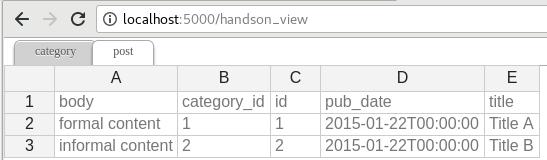

.. Flask-Excel documentation master file, created by
   sphinx-quickstart on Wed Jan 07 08:46:32 2015.
   You can adapt this file completely to your liking, but it should at least
   contain the root `toctree` directive.

`Flask-Excel` - Let you focus on data, instead of file formats
================================================================================

:Author: chfw
:Source code: http://github.com/pyexcel-webwares/Flask-Excel.git
:Issues: http://github.com/pyexcel-webwares/Flask-Excel/issues
:License: New BSD License
:Released: |version|
:Generated: |today|

Here is a typical conversation between the developer and the user::

 User: "I have uploaded an excel file"
       "but your application says un-supported file format"
 Developer: "Did you upload an xlsx file or a csv file?"
 User: "Well, I am not sure. I saved the data using "
       "Microsoft Excel. Surely, it must be in an excel format."
 Developer: "OK. Here is the thing. I were not told to support"
            "all available excel formats in day 1. Live with it"
            "or delay the project x number of days."

**Flask-Excel** is based on `pyexcel <https://github.com/pyexcel/pyexcel>`_ and makes
it easy to consume/produce information stored in excel files over HTTP protocol as
well as on file system. This library can turn the excel data into a list of lists,
a list of records(dictionaries), dictionaries of lists. And vice versa. Hence it
lets you focus on data in Flask based web development, instead of file formats.

The idea originated from the common usability problem: when an excel file
driven web application is delivered for non-developer users (ie: team assistant,
human resource administrator etc). The fact is that not everyone knows (or cares)
about the differences between various excel formats: csv, xls, xlsx are all
the same to them. Instead of training those users about file formats, this
library helps web developers to handle most of the excel file
formats by providing a common programming interface. To add a specific excel
file format type to you application, all you need is to install an extra pyexcel
plugin. Hence no code changes to your application and no issues with excel file
formats any more. Looking at the community, this library and its associated ones
try to become a small and easy to install alternative to Pandas.

The highlighted features are:

#. excel data import into and export from databases
#. turn uploaded excel file directly into Python data structure
#. pass Python data structures as an excel file download
#. provide data persistence as an excel file in server side
#. supports csv, tsv, csvz, tsvz by default and other formats are supported via
   the following plugins:

.. _file-format-list:
.. _a-map-of-plugins-and-file-formats:

.. table:: A list of file formats supported by external plugins

   ======================== ======================= ================= ==================
   Package name              Supported file formats  Dependencies     Python versions
   ======================== ======================= ================= ==================
   `pyexcel-io`_ >=v0.6.0   csv, csvz [#f1]_, tsv,                    3.6+ 
                            tsvz [#f2]_                               
   `pyexcel-io`_ <=0.5.20   same as above                             2.6, 2.7, 3.3,
                                                                      3.4, 3.5, 3.6
                                                                      pypy
   `pyexcel-xls`_           xls, xlsx(read only),   `xlrd`_,          same as above
                            xlsm(read only)         `xlwt`_
   `pyexcel-xlsx`_          xlsx                    `openpyxl`_       same as above
   `pyexcel-ods3`_          ods                     `pyexcel-ezodf`_, 2.6, 2.7, 3.3, 3.4
                                                    lxml              3.5, 3.6
   `pyexcel-ods`_           ods                     `odfpy`_          same as above
   ======================== ======================= ================= ==================

.. table:: Dedicated file reader and writers

   ======================== ======================= ================= ==================
   Package name              Supported file formats  Dependencies     Python versions
   ======================== ======================= ================= ==================
   `pyexcel-xlsxw`_         xlsx(write only)        `XlsxWriter`_     Python 2 and 3
   `pyexcel-xlsxr`_         xlsx(read only)         lxml              same as above
   `pyexcel-xlsbr`_         xlsx(read only)         pyxlsb            same as above
   `pyexcel-odsr`_          read only for ods, fods lxml              same as above
   `pyexcel-odsw`_          write only for ods      loxun             same as above
   `pyexcel-htmlr`_         html(read only)         lxml,html5lib     same as above
   `pyexcel-pdfr`_          pdf(read only)          pdftables         Python 2 only.
   ======================== ======================= ================= ==================

Plugin shopping guide
------------------------

Except csv files, xls, xlsx and ods files are a zip of a folder containing a lot of
xml files 

The dedicated readers for excel files can stream read 

In order to manage the list of plugins installed, you need to use pip to add or remove
a plugin. When you use virtualenv, you can have different plugins per virtual
environment. In the situation where you have multiple plugins that does the same thing
in your environment, you need to tell pyexcel which plugin to use per function call.
For example, pyexcel-ods and pyexcel-odsr, and you want to get_array to use pyexcel-odsr.
You need to append get_array(..., library='pyexcel-odsr').

.. _pyexcel-io: https://github.com/pyexcel/pyexcel-io
.. _pyexcel-xls: https://github.com/pyexcel/pyexcel-xls
.. _pyexcel-xlsx: https://github.com/pyexcel/pyexcel-xlsx
.. _pyexcel-ods: https://github.com/pyexcel/pyexcel-ods
.. _pyexcel-ods3: https://github.com/pyexcel/pyexcel-ods3
.. _pyexcel-odsr: https://github.com/pyexcel/pyexcel-odsr
.. _pyexcel-odsw: https://github.com/pyexcel/pyexcel-odsw
.. _pyexcel-pdfr: https://github.com/pyexcel/pyexcel-pdfr

.. _pyexcel-xlsxw: https://github.com/pyexcel/pyexcel-xlsxw
.. _pyexcel-xlsxr: https://github.com/pyexcel/pyexcel-xlsxr
.. _pyexcel-xlsbr: https://github.com/pyexcel/pyexcel-xlsbr
.. _pyexcel-htmlr: https://github.com/pyexcel/pyexcel-htmlr

.. _xlrd: https://github.com/python-excel/xlrd
.. _xlwt: https://github.com/python-excel/xlwt
.. _openpyxl: https://bitbucket.org/openpyxl/openpyxl
.. _XlsxWriter: https://github.com/jmcnamara/XlsxWriter
.. _pyexcel-ezodf: https://github.com/pyexcel/pyexcel-ezodf
.. _odfpy: https://github.com/eea/odfpy

.. table:: Other data renderers

   ======================== ======================= ================= ==================
   Package name              Supported file formats  Dependencies     Python versions
   ======================== ======================= ================= ==================
   `pyexcel-text`_          write only:rst,         `tabulate`_       2.6, 2.7, 3.3, 3.4
                            mediawiki, html,                          3.5, 3.6, pypy
                            latex, grid, pipe,
                            orgtbl, plain simple
                            read only: ndjson
                            r/w: json
   `pyexcel-handsontable`_  handsontable in html    `handsontable`_   same as above
   `pyexcel-pygal`_         svg chart               `pygal`_          2.7, 3.3, 3.4, 3.5
                                                                      3.6, pypy
   `pyexcel-sortable`_      sortable table in html  `csvtotable`_     same as above
   `pyexcel-gantt`_         gantt chart in html     `frappe-gantt`_   except pypy, same
                                                                      as above
   ======================== ======================= ================= ==================

.. _pyexcel-text: https://github.com/pyexcel/pyexcel-text
.. _tabulate: https://bitbucket.org/astanin/python-tabulate
.. _pyexcel-handsontable: https://github.com/pyexcel/pyexcel-handsontable
.. _handsontable: https://cdnjs.com/libraries/handsontable
.. _pyexcel-pygal: https://github.com/pyexcel/pyexcel-chart
.. _pygal: https://github.com/Kozea/pygal
.. _pyexcel-matplotlib: https://github.com/pyexcel/pyexcel-matplotlib
.. _matplotlib: https://matplotlib.org
.. _pyexcel-sortable: https://github.com/pyexcel/pyexcel-sortable
.. _csvtotable: https://github.com/vividvilla/csvtotable
.. _pyexcel-gantt: https://github.com/pyexcel/pyexcel-gantt
.. _frappe-gantt: https://github.com/frappe/gantt

.. rubric:: Footnotes

.. [#f1] zipped csv file
.. [#f2] zipped tsv file

This library makes information processing involving various excel files as easy as
processing array, dictionary when processing file upload/download, data import into
and export from SQL databases, information analysis and persistence. It uses
**pyexcel** and its plugins:

#. to provide one uniform programming interface to handle csv, tsv, xls, xlsx, xlsm and ods formats.
#. to provide one-stop utility to import the data in uploaded file into a database and to export tables in a database as excel files for file download.
#. to provide the same interface for information persistence at server side: saving a uploaded excel file to and loading a saved excel file from file system.

Installation
-------------------

You can install Flask-Excel via pip:

.. code-block:: bash

    $ pip install Flask-Excel

or clone it and install it:

.. code-block:: bash

    $ git clone https://github.com/pyexcel-webwares/Flask-Excel.git
    $ cd Flask-Excel
    $ python setup.py install

Installation of individual plugins , please refer to individual plugin page. For example, if you need xls file support, please install pyexcel-xls::

        $ pip install pyexcel-xls

Setup
------------------------

In your application, you must import it before using it::

    import flask_excel as excel

    ...
    excel.init_excel(app) # required since version 0.0.7

Quick start
--------------------------------------------------------------------------------

A minimal application may look like this:

.. literalinclude:: ../../examples/tiny_example.py

The tiny application exposes four urls:

#. one for file upload
#. three urls for file download.

The first url presents a simple file upload html and responds
back in json with the content of the uploaded file. Here is an
`example file <https://github.com/pyexcel/Flask-Excel/blob/master/examples/example_for_upload.csv>`_
for testing but you can upload any other excel file. The file upload handler
uses `request.get_array` to parse the uploaded file and gets an array back.
The parameter **file** is coded in the html form::

    <input ... name=file>

.. warning::
   If 'field_name' was not specified, for example `request.get_array('file')`
   in upload_file() function, your browser would display "Bad Request: The
   browser (or proxy) sent a request that this server could not understand."

The rest of the links simply throw back a csv file whenever a http request is made to
http://localhost:50000/download/. :meth:`~excel.make_response_from_array` takes a
list of lists and a file type as parameters and sets up the mime type of the
http response. If you would like to give 'tsvz' a go, please change "csv" to
"tsvz".

Support the project
-----------------------

If your company has embedded pyexcel and its components into a revenue generating
product, please support me on github, `patreon <https://www.patreon.com/bePatron?u=5537627>`_
or `bounty source <https://salt.bountysource.com/teams/chfw-pyexcel>`_ to maintain
the project and develop it further.

If you are an individual, you are welcome to support me too and for however long
you feel like. As my backer, you will receive
`early access to pyexcel related contents <https://www.patreon.com/pyexcel/posts>`_.

And your issues will get prioritized if you would like to become my patreon as `pyexcel pro user`.

With your financial support, I will be able to invest
a little bit more time in coding, documentation and writing interesting posts.

More excel file formats
------------------------

The example application understands csv, tsv and its zipped variants: csvz and tsvz. If you would like to expand the list of supported excel file formats (see :ref:`file-format-list`) for your own application, you could install one or all of the following::

    pip install pyexcel-xls
    pip install pyexcel-xlsx
    pip install pyexcel-ods

.. warning::

   If you are using pyexcel <=0.2.1, you still need to import each plugin manually, e.g. `import pyexcel.ext.xls` and
   Your IDE or pyflakes may highlight it as un-used but it is used. The registration of
   the extra file format support happens when the import action is performed

Data import and export
--------------------------------------------------------------------------------

Continue with the previous example, the data import and export will be explained.
You can copy the following code in their own appearing sequence and paste them
after the place holder::

    # insert database related code here

Alternatively, you can find the complete example on
`github <https://github.com/pyexcel/Flask-Excel/blob/master/examples/database_example.py>`_

Now let's add the following imports first::

    from flask_sqlalchemy import SQLAlchemy # sql operations

And please make sure that you have pyexcel-xls and pyexcel-handsontable installed::

	pip install pyexcel-xls, pyexcel-handsontable

Now configure the database connection. Sqllite will be used and **tmp.db** will
be used and can be found in your current working directory::

    app.config['SQLALCHEMY_DATABASE_URI'] = 'sqlite:///tmp.db'
    db = SQLAlchemy(app)

And paste some models from Flask-SQLAlchemy's documentation:

.. literalinclude:: ../../examples/database_example.py
   :lines: 38-69

Now let us create the tables in the database:

.. literalinclude:: ../../examples/database_example.py
   :lines: 71-73

Write up the view functions for data import:

.. literalinclude:: ../../examples/database_example.py
   :lines: 75-100

In the code, `category_init_func` and `post_init_func` are custom initialization
functions for Category and Post respectively. In the situation where you want to
skip certain rows, None should should be returned and flask_excel will ignore the row.

Write up the view function for data export:

.. literalinclude:: ../../examples/database_example.py
   :lines: 103-106

Then run the example again. Visit http://localhost:5000/import and upload
`sample-data.xls <https://github.com/pyexcel/Flask-Excel/blob/master/sample-data.xls>`_.

And it responds with

This result is rendered via `pyexcel-handsontable <https://github.com/pyexcel/pyexcel-handsontable>`_.
All you needed is to put 'handsontable.html' as file type:

.. literalinclude:: ../../examples/database_example.py
   :lines: 115-119

Then visit http://localhost:5000/export to download the data back.

Export filtered query sets
--------------------------------------------------------------------------------

Previous example shows you how to dump one or more tables over http protocol.
Hereby, let's look at how to turn a query sets into an excel sheet. You can
pass a query sets and an array of selected column names to
:meth:`~flask_excel.make_response_from_query_sets` and generate an excel sheet from it:

.. literalinclude:: ../../examples/database_example.py
   :lines: 108-113

Then visit http://localhost:5000/custom_export to download the data
.. _data-types-and-its-conversion-funcs:

All supported data types
--------------------------

The example application likes to have array but it is not just about arrays. Here is table of functions for all supported data types:

=========================== ======================================================== ==================================================
data structure              from file to data structures                             from data structures to response
=========================== ======================================================== ==================================================
dict                        :meth:`~flask_excel.ExcelRequest.get_dict`               :meth:`~flask_excel.make_response_from_dict`
records                     :meth:`~flask_excel.ExcelRequest.get_records`            :meth:`~flask_excel.make_response_from_records`
a list of lists             :meth:`~flask_excel.ExcelRequest.get_array`              :meth:`~flask_excel.make_response_from_array`
dict of a list of lists     :meth:`~flask_excel.ExcelRequest.get_book_dict`          :meth:`~flask_excel.make_response_from_book_dict`
:class:`pyexcel.Sheet`      :meth:`~flask_excel.ExcelRequest.get_sheet`              :meth:`~flask_excel.make_response`
:class:`pyexcel.Book`       :meth:`~flask_excel.ExcelRequest.get_book`               :meth:`~flask_excel.make_response`
database table              :meth:`~flask_excel.ExcelRequest.save_to_database`       :meth:`~flask_excel.make_response_from_a_table`
                            :meth:`~flask_excel.ExcelRequest.isave_to_database`
a list of database tables   :meth:`~flask_excel.ExcelRequest.save_book_to_database`  :meth:`~flask_excel.make_response_from_tables`
                            :meth:`~flask_excel.ExcelRequest.isave_book_to_database`
a database query sets                                                                :meth:`~flask_excel.make_response_from_query_sets`
a generator for records     :meth:`~django_excel.ExcelMixin.iget_records`
a generator of lists        :meth:`~django_excel.ExcelMixin.iget_array`
=========================== ======================================================== ==================================================

See more examples of the data structures in :ref:`pyexcel documentation<pyexcel:a-list-of-data-structures>`

API Reference
---------------

**Flask-Excel** attaches **pyexcel** functions to **Request** class.

.. module:: flask_excel.ExcelRequest

ExcelRequest
******************

.. method:: get_sheet(field_name=None, sheet_name=None, **keywords)

   :param field_name: the file field name in the html form for file upload
   :param sheet_name: For an excel book, there could be multiple sheets. If it is left
                      unspecified, the sheet at index 0 is loaded. For 'csv', 'tsv' file,
                      *sheet_name* should be None anyway.
   :param keywords: additional keywords to :meth:`pyexcel.get_sheet`
   :returns: A sheet object

   The following html form, the *field_name* should be "file"::

       <!doctype html>
       <title>Upload an excel file</title>
       <h1>Excel file upload (csv, tsv, csvz, tsvz only)</h1>
       <form action="" method=post enctype=multipart/form-data>

       <input type=file name=file><input type=submit value=Upload>
       </form>

.. method:: get_array(field_name=None, sheet_name=None, **keywords)

   :param field_name: same as :meth:`~flask_excel.ExcelRequest.get_sheet`
   :param sheet_name: same as :meth:`~flask_excel.ExcelRequest.get_sheet`
   :param keywords: additional keywords to pyexcel library
   :returns: a two dimensional array, a list of lists

.. method:: get_dict(field_name=None, sheet_name=None, name_columns_by_row=0, **keywords)

   :param field_name: same as :meth:`~flask_excel.ExcelRequest.get_sheet`
   :param sheet_name: same as :meth:`~flask_excel.ExcelRequest.get_sheet`
   :param name_columns_by_row: uses the first row of the sheet to be column headers by default.
   :param keywords: additional keywords to pyexcel library
   :returns: a dictionary of the file content

.. method:: get_records(field_name=None, sheet_name=None, name_columns_by_row=0, **keywords)

   :param field_name: same as :meth:`~flask_excel.ExcelRequest.get_sheet`
   :param sheet_name: same as :meth:`~flask_excel.ExcelRequest.get_sheet`
   :param name_columns_by_row: uses the first row of the sheet to be record field names by default.
   :param keywords: additional keywords to pyexcel library
   :returns: a list of dictionary of the file content

.. method:: get_book(field_name=None, **keywords)

   :param field_name: same as :meth:`~flask_excel.ExcelRequest.get_sheet`
   :param keywords: additional keywords to pyexcel library
   :returns: a two dimensional array, a list of lists

.. method:: get_book_dict(field_name=None, **keywords)

   :param field_name: same as :meth:`~flask_excel.ExcelRequest.get_sheet`
   :param keywords: additional keywords to pyexcel library
   :returns: a two dimensional array, a list of lists

.. method:: save_to_database(field_name=None, session=None, table=None, initializer=None, mapdict=None **keywords)

   :param field_name: same as :meth:`~flask_excel.ExcelRequest.get_sheet`
   :param session: a SQLAlchemy session
   :param table: a database table
   :param initializer: a custom table initialization function if you have one
   :param mapdict: the explicit table column names if your excel data do not have the exact column names
   :param keywords: additional keywords to :meth:`pyexcel.Sheet.save_to_database`

.. method:: isave_to_database(field_name=None, session=None, table=None, initializer=None, mapdict=None **keywords)

   similar to :meth:`:meth:`~flask_excel.ExcelRequest.isave_to_database`. But it requires
   less memory.

   This requires column names must be at the first row.

.. method:: save_book_to_database(field_name=None, session=None, tables=None, initializers=None, mapdicts=None, **keywords)

   :param field_name: same as  :meth:`~flask_excel.ExcelRequest.get_sheet`
   :param session: a SQLAlchemy session
   :param tables: a list of database tables
   :param initializers: a list of model initialization functions.
   :param mapdicts: a list of explicit table column names if your excel data sheets do not have the exact column names
   :param keywords: additional keywords to :meth:`pyexcel.Book.save_to_database`

.. method:: isave_book_to_database(field_name=None, session=None, tables=None, initializers=None, mapdicts=None, **keywords)

   similar to :meth:`:meth:`~flask_excel.ExcelRequest.isave_book_to_database`. But it requires
   less memory.

   This requires column names must be at the first row in each sheets

Response methods
**********************

.. module:: flask_excel

.. method:: make_response(pyexcel_instance, file_type, status=200, file_name=None)

   :param pyexcel_instance: :class:`pyexcel.Sheet` or :class:`pyexcel.Book`
   :param file_type: one of the following strings:

                     * 'csv'
                     * 'tsv'
                     * 'csvz'
                     * 'tsvz'
                     * 'xls'
                     * 'xlsx'
                     * 'xlsm'
                     * 'ods'

   :param status: unless a different status is to be returned.
   :param file_name: provide a custom file name for the response, excluding the file extension

.. method:: make_response_from_array(array, file_type, status=200, file_name=None)

   :param array: a list of lists
   :param file_type: same as :meth:`~flask_excel.make_response`
   :param status: same as :meth:`~flask_excel.make_response`
   :param file_name: same as :meth:`~flask_excel.make_response`

.. method:: make_response_from_dict(dict, file_type, status=200, file_name=None)

   :param dict: a dictionary of lists
   :param file_type: same as :meth:`~flask_excel.make_response`
   :param status: same as :meth:`~flask_excel.make_response`
   :param file_name: same as :meth:`~flask_excel.make_response`

.. method:: make_response_from_records(records, file_type, status=200, file_name=None)

   :param records: a list of dictionaries
   :param file_type: same as :meth:`~flask_excel.make_response`
   :param status: same as :meth:`~flask_excel.make_response`
   :param file_name: same as :meth:`~flask_excel.make_response`

.. method:: make_response_from_book_dict(book_dict, file_type, status=200, file_name=None)

   :param book_dict: a dictionary of two dimensional arrays
   :param file_type: same as :meth:`~flask_excel.make_response`
   :param status: same as :meth:`~flask_excel.make_response`
   :param file_name: same as :meth:`~flask_excel.make_response`

.. method:: make_response_from_a_table(session, table, file_type, status=200, file_name=None)

   Produce a single sheet Excel book of *file_type*

   :param session: SQLAlchemy session
   :param table: a SQLAlchemy table
   :param file_type: same as :meth:`~flask_excel.make_response`
   :param status: same as :meth:`~flask_excel.make_response`
   :param file_name: same as :meth:`~flask_excel.make_response`

.. method:: make_response_from_query_sets(query_sets, column_names, file_type, status=200, file_name=None)

   Produce a single sheet Excel book of *file_type* from your custom database queries

   :param query_sets: a query set
   :param column_names: a nominated column names. It could not be None, otherwise no data is returned.
   :param file_type: same as :meth:`~flask_excel.make_response`
   :param status: same as :meth:`~flask_excel.make_response`
   :param file_name: same as :meth:`~flask_excel.make_response`

.. method:: make_response_from_tables(session, tables, file_type, status=200, file_name=None)

   Produce a multiple sheet Excel book of *file_type*. It becomes the same
   as :meth:`~flask_excel.make_response_from_a_table` if you pass *tables*
   with an array that has a single table

   :param session: SQLAlchemy session
   :param tables: SQLAlchemy tables
   :param file_type: same as :meth:`~flask_excel.make_response`
   :param status: same as :meth:`~flask_excel.make_response`
   :param file_name: same as :meth:`~flask_excel.make_response`

.. include:: ../../CHANGELOG.rst
